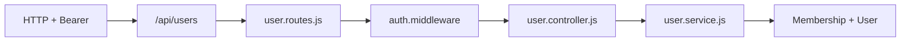

# Feature **User**

Documentação da feature de usuários do HOOKO API. Todo o código vive em `SRC/Features/User/`; esta pasta espelha essa estrutura em `SRC/documentacao/feature/user`.

## Escopo da feature

- Operações relacionadas ao modelo [**User**](../../../Models/user.js) para **consumo dentro do tenant** (lista de colegas de organização).
- **Routes → Controller → Service → Models** + **`authMiddleware`** em todas as rotas.

## Árvore de arquivos (código)

| Arquivo | Papel |
|---------|--------|
| `user.routes.js` | `Router`; aplica **`authMiddleware`** antes dos handlers. |
| `user.controller.js` | Deriva escopo a partir de `req.user.memberships` (orgs ativas no JWT). |
| `user.service.js` | `Membership` + `User` — apenas usuários com membership **ativa/null** nas orgs escopadas. |

Montagem na API principal: [`SRC/Routes/index.js`](../../../Routes/index.js) registra **`router.use('/users', userRoutes)`** sob **`/api`**.

## Prefixo de URL

```text
/api/users
```

## Endpoints implementados

| Método | Caminho completo | Autenticação | Descrição |
|--------|------------------|---------------|------------|
| `GET` | `/api/users/` | **JWT** | Lista usuários das **mesmas organizações** que o token (interseção via `Membership`: status `active` ou `null`). Sem memberships ativas → `[]`. **`passwordHash` excluído** (`defaultScope` do model). |
| `GET` | `/api/users/_meta/stats` | **JWT** | `{ ok: true, totalUsers, scopeOrganizationCount }` — contagem distinta de usuários no mesmo escopo tenant. |

## Multi-tenant e segurança

- O JWT carrega apenas memberships **ativas** no login (`auth.service`).
- **`GET /api/users`** não substitui o painel Admin: visão global, paginação e convites ficam em **`/api/admin/users`**.
- Helpers compartilhados com OAuth / MetaSync: [`SRC/Utils/ensure_organization_membership.util.js`](../../../Utils/ensure_organization_membership.util.js).

## Fluxo de requisição (resumo)



## Tratamento de erros

- `next(error)` → handler global em **`SRC/App.js`**.

## Referências rápidas

- Model User: [`../../model/user.md`](../../model/user.md)
- Rotas agregadas: [`../../../Routes/index.js`](../../../Routes/index.js)
